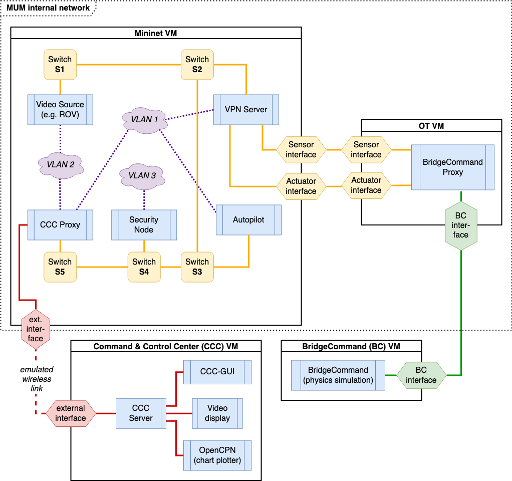

# XLUUV Security Test Environment

This project provides a security test framework for an Extra-Large Unmanned Underwater Vehicle (XLUUV).
The test framework consists of a simulation of the physical environment and a virtual replica of the internal network and the external communication links of XLUUV.
Thus, the test framework allows for simulations of missions and the according behavior of the vessel including the full communication and navigation.
The test framework can be used for threat modeling, vulnearbility research, and testing attack scenarios.
Although the test framework is intended to simulate realistic behavior it is of course due to practical and technical reasons just a simplified model of the reality.

###### Publication

Wolsing, Konrad, et al. "XLab-UUV–A Virtual Testbed for Extra-Large Uncrewed Underwater Vehicles." 2023 IEEE 48th Conference on Local Computer Networks (LCN). IEEE, 2023. [10.1109/LCN58197.2023.10223405](https://doi.org/10.1109/LCN58197.2023.10223405)


## Quickstart Guide

To deploy the test environment the following steps are required.


### Installation

1. Clone the repository
    - Make sure to have git lfs installed and initialized properly. To make sure, run `git lfs fetch --all` and `git lfs pull`.
2. Install the dependencies:
    - Python 3.9+
    - Tmux
    - Virtualbox >= 7.1
    - Vagrant and Vagrant plugins: `vagrant-env`, `dotenv`, `vagrant-disksize`
    - Ansible
    - wmctrl (on Ubuntu / Debian: `sudo apt-get install wmctrl `) 
3. Create a virtual environment (e.g. `python3 -m venv venv`) and activate it (`source ./venv/bin/activate`)
4. Install the test environment with pip: `pip install provisioning/`


### Deploy, start and stop the environment

- Build the VMs from their Vagrant boxes (this can take some time): `xluuv -p <REPO-ROOT-DIRECTORY> build`
	- For more control on the build process and potential errors, try to build the VMs manually. To this end, execute `vagrant up --provision` inside the following directories: `vms/bc`, `vms/ot`, `vms/ccc`, and `vms/mininet`.
	- After the VMs are built and have booted successfully they can be shutdown with `vagrant halt`.
- Start the XLUUV test environment: `xluuv -p <REPO-ROOT-DIRECTORY> up`
- Stop the XLUUV test environment: `xluuv -p <REPO-ROOT-DIRECTORY> down`

`<REPO-ROOT-DIRECTORY>` is the root of the git repository, e.g. `./` if the command is run from within the main directory.

*Note:* If the test environment or components of it have been updated it can be necessary to re-build the VMs.
This can be achieved by running the build command again `xluuv -p <REPO-ROOT-DIRECTORY> build`.

If not all VMs have to be rebuilt, each VM can be rebuilt seaparately through the following steps:

- Navigate to the VM's subdirectory, where the respective `Vagrantfile` is located, e.g. `./vms/bc/`
- Run `vagrant destroy` and confirm if required to destroy the current installation of the VM
- Run `vagrant up --provision` to (re)build the VM from the vagrant box and boot it
- After the VM is built and has booted successfully it can be shutdown with `vagrant halt`

After this the VM is ready to use with the `xluuv up` command again.


### Options

Apart from the defaults, a few options can be chosen on running `xluuv up`:

```
% xluuv up --help
usage: xluuv up [-h] [-s SCENARIO] [-e] [--macsec] [-v]

options:
  -h, --help            show this help message and exit
  -s SCENARIO, --scenario SCENARIO
                        Name of the Scenario: SimpleEstuary (default), or SantaCatalina
  -e, --external        Use an external BridgeCommand instance (Default: False)
  --macsec              Enable MACsec encryption between switches inside the network
  -v, --verbose
  -l LAYOUT, --layout LAYOUT
                        Path of the X11 window layout config to load.
```

*Scenario:* By default the scenario `SimpleEstuary` is used. A second scenario, `SantaCatalina`, can be chosen optionally instead.

*External:* By default BridgeCommand and OpenCPN are executed in their own VMs which can impact the graphics quality. To improve performance they can also be run directly on the host. For OpenCPN just install the program regularly and import the carts from `vms/ccc/opencpn/Charts`. For BridgeCommand, compile the program in `vms/bc/bc`.

*Macsec:* Enables MACsec for all links of the internal XLUUV network to add an additional security layer of point-to-point encryption and integrity checks. It is disabled by default because it reduces the network speed of the XLUUV network significantly.

*Verbose:* Enables printing of additional debug messages.

*Layout:* Loads a window layout, i.e., a configuration for the positioning and size of the windows. The config file is expected to be a JSON. If no argument is provided, the last used layout is loaded.


### Layouts
Different window layouts, i.e. the exact position and size of the graphic applications, can be defined with the help of `xluuv layout`.
This is useful for presentations and to avoid that windows spawning on random displays for multi-monitor setups or that the windows are either too large or too small.

```
% xluuv layout --help
usage: xluuv layout [-h] (-s SAVE | -l LOAD) [-v]

options:
  -h, --help            show this help message and exit
  -s SAVE, --save SAVE  Path to which the current window layout will be saved as JSON.
  -l LOAD, --load LOAD  Path of the layout config to load.
  -v, --verbose
```

*Save:* Path to which the current window layout (JSON file) is saved.

*Load:* Load a window layout from its JSON config file, and applies it to the graphical applications.

The workflow consists of first creating one (or multiple) layout(s) with `xluuv layout --save <LAYOUT-NAME>`. 
Note, that the `--save` option saves the current window positioning and sizes to a JSON file. It does not do any configuration. 
Thus, the user is expected first to move the windows to the wanted displays and resize them to fit their needs.
Only then, the `--save` command should be used.
Secondly, a specific window layout can be loaded using either `xluuv up --layout <PATH-TO-LAYOUT>` or `xluuv layout --load <PATH-TO-LAYOUT>`.
The latter command should only be used after the provisioning has finished.

Note, that if the `--layout` flag for `xluuv up` is omitted, that the last used layout is loaded.
This last used layout is remembered via a symlink in the `~/.config/xluuv` directory. 
Whenever a layout is either saved or loaded, this symlink is updated.
Thus, the user needs only once to create a default layout, which is then automatically loaded after provisioning.

## Test Environment and Components

The XLUUV test environment provides a virtualized replica of the internal network of the XLUUV and its external communication links.
The internal network is emulated by Mininet.
BridgeCommand (BC) simulates a model of the vessel and its behavior in a simulated physical environment.
In particular, BridgeCommand simulates the sensors and actuators of the vessel.
The OT device connects the sensors and actuators simulated by BridgeCommand to the internal XLUUV network.
The Command and Control Center (CCC) is an external entity for remote monitoring and control of the vessel.

Mininet, CCC and OT each run in a separate VM.
BridgeCommand runs in a VM by default but can be executed directly on the host for better simulation and graphics performance.


### Mininet

Mininet emulates the internal network.
The VM running Mininet is equipped with three network interfaces, two XLUUV-internal interfaces for the links to sensors, actuators and one external interface.
The external interface (e.g. for the link to the CCC) is configured such that it simulates a wireless connection with lower data rates and higher latency compared to the internal network.
The Data Distribution Service (DDS) is used for the communication in the internal network.
DDS is a network middleware implementing a publish-subscribe pattern for data exchange.

The Mininet runs multiple virtual network nodes:

- A CCC proxy which is connected to the external link to the CCC to forward communication between the internal network and the CCC
- An Autopilot which navigates the XLUUV and receives instructions from the CCC
- A node sending a video stream to the CCC simulating live camera footage from a ROV
- A VPN server to enable the OT VM to connect with the internal network




### Bridge Command

BridgeCommand ([https://www.bridgecommand.co.uk/](https://www.bridgecommand.co.uk/)) provides the physics simulation of the vessel and its surrounding environment.
Thus, it provides a simulation of the sensors and actuators and the vessels physical behavior.
The simulation of the sensors outputs the sensor data.
The actuator simulation (rudder, engine, propeller, etc.) can be influenced through the inpout of control commands.
BridgeCommand is connected to the internal network via a OT VM for sending sensor data and receiving control commands.

More information on the usage and configuration options of BridgeCommand can be found [here](./vms/bc/README.md).


### OT VM

The OT VM is part of the internal network and forwards data from the sensors to the internal network and control commands from the internal network to the actuators.
Both, sensors and actuators are simulated by BridgeCommand.

In contrast to the other VMs, for the OT VM we use a FreeBSD vagrant box.

### Command and Control Center (CCC)

The Command and Control Center (CCC) is an external entity connected via an emulated wireless link.
It includes a control panel for remote monitoring and control of the vessel and a chart plotter (OpenCPN).
Additionally, the CCC receives and plays a video stream.
In a real scenario the video stream would show live camera footage from the XLUUV or from a ROV that can be deployed by the XLUUV.
In the test environment the video stream is sent from within the mininet via the "external" link and shows a recorded video.
Furthermore, the CCC provides a chart plotter which displays the current status of the sensor data.


### Autopilot

The autopilot runs inside the Mininet VM.
It is able to process given missions and can be controlled from the CCC.
A mission consists of a sequence of instructions, e.g. telling the autopilot to follow a specific route.

Different navigation scenarios can be created by defining missions for the autopilot.
Given a predefined mission, the autopilot folows its steps.
Examples for missions, procedures etc. can be found under `./components/ccc/examples/`. Execute `./components/ccc/examples/create_zips.py` from within the examples directory to generate mission bundle zip archives.

#### Mission Format

A mission is described as a JSON file, containing the mandatory `mission` key and object, and optionally a `procedures` key and object.

The mission object describes the mission itself: its `id` (unused for now), `name` (used in logging and GUI), and `items` (the actual mission steps that will be executed by the autopilot).


Simple example:
```json
{
    "mission": {
        "id": 1,
        "name": "Dev Mission",
        "items": [
            {
            "until_completion": true,
            "activate_route": 101
            },
            {
            "until_completion": true,
            "activate_loiterpos": 41
            },
            {
            "until_completion": true,
            "activate_diveproc": 1
            },
            {
            "until_timeout": 300,
            "set_ap_cmd": "AC_ROUTE_START"
            }
        ]
    }
}
```

A mission item must specify its *duration* and its *action*.

A mission item object can either be run until completion (`"until_completion": true`, see [below](#effects-of-until_completion)), or a timeout of `n` seconds (`"until_timeout": n`), with `-1` being an infinite timeout.

The action of a step can be either one of 
- `activate_route: <route_id>`
- `activate_loiterpos: <loiter_pos_id>`
- `activate_diveproc: <dive_proc_id>`
- `set_ap_cmd: <AutopilotCommand>` (see `messages.proto` for a list of `AutopilotCommand` enum values)

##### Effects of until_completion

| Action | Completion |
| --- | --- |
| `MIAT_ACT_LP` | After the activate call |
| `MIAT_ACT_ROUTE` | After the activate call |
| `MIAT_ACT_DP` | After the activate call |
| `AC_ROUTE_START` | When the last waypoint of the route is reached, or after the start call if it fails |
| `AC_ROUTE_STOP` | After the cmd call |
| `AC_ROUTE_SUSPEND` | After the cmd call |
| `AC_ROUTE_RESUME` | After the last waypoint of the resumed route is reached, or after the cmd call if it fails |
| `AC_LOITER_START` | After reaching the loiter zone |
| `AC_LOITER_STOP` | After the cmd call |
| `AC_EMERGENCY_STOP` | After reaching ~0.0 m/s |
| `AC_DIVE_START` | After reaching the target depth |

Any AP command sent directly by the CCC suspends the MissionController and marks the current action as completed.

##### Mission Bundles

For a mission to be executed correctly, all the procedures that are activated during its execution must have been sent to the Autopilot and stored beforehand. To simplify this process, a mission can be bundled with the files specifying the procedures and sent as a zip archive to `ccc-server` which then forwards the individual procedures and the mission itself to XLUUV's Autopilot.

The format for such an archive only requires a file named `mission.json` to be placed at the root of the archive, and for it to contain the mandatory `mission` key and object, but also a `procedures` object, which provides lists of `routes`, `dive_procedures` and `loiter_positions`.

Example:
```json
{
    "procedures": {
        "routes": [
            {
                "id": 1,
                "path": "./routes/SimpleEstuary_dev_1.gpx"
            }
        ],
        "dive_procedures": [
            {
                "id": 1,
                "path": "./dive_procedures/dev_dp.json"
            }
        ],
        "loiter_positions": [
            {
                "id": 42,
                "path": "./loiter_positions/SimpleEstuary_lp_1.json"
            }
        ]
    },
    "mission": {
        ...
    }
}
```

The `path` of each procedure must correspond to the path within the zip archive. The `id` overrides any potential id specified in a procedure's file and is the id under which the procedure will be stored in the Autopilot (and as such must be unique amongst procedures of each type)
